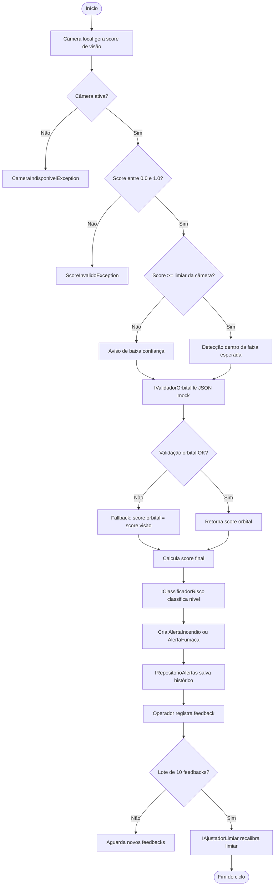

# FAROL Orbital — Módulo VIGÍLIA

**Global Solution 2026 · Space Connect · FIAP**  
**Disciplina:** C# / .NET

---

## Integrantes

| Nome | RM |
|---|---|
| Albert Katri | RM556544 |
| Bruno Biletsky | RM554739 |
| Paulo Akira | RM556840 |

---

## Motivação

O **FAROL Orbital** é uma plataforma de detecção e alerta ambiental que integra **visão computacional local simulada** com **validação orbital simulada** para classificar eventos de risco e apoiar a tomada de decisão da Defesa Civil.

O foco do MVP é demonstrar, em C#/.NET, como um sistema crítico pode receber sinais locais, validar o risco com uma camada orbital mockada, classificar alertas, registrar histórico e usar feedback operacional para ajustar o limiar de confiança das câmeras.

---

## Relação com a Global Solution — Space Connect

O tema **Space Connect** orienta a solução a usar a indústria espacial como camada de confiabilidade. No projeto:

- a câmera local representa o sensor terrestre que identifica possíveis eventos ambientais;
- o arquivo `Data/dados_orbitais_mock.json` simula dados orbitais/satelitais no MVP;
- o motor combina `score_visao` e `score_orbital` para gerar um `score_final`;
- o operador da Defesa Civil confirma ou nega alertas, fechando um ciclo simples de feedback.

O MVP trabalha com **incêndio** e **fumaça densa**, mantendo coerência com a proposta de detecção ambiental por câmera.

---

## Como executar

Pré-requisito: .NET 8 SDK instalado.

```bash
cd FarolOrbital
dotnet build
dotnet run
```

---

## Estrutura de pastas

```text
FarolOrbital/
├── Data/
│   └── dados_orbitais_mock.json
├── Docs/
│   └── Evidencias/
│       ├── 01_build_sucesso_+_menu_principal.jpg
│       ├── 02_cameras_cadastradas.jpg
│       ├── 03_alerta_alto.jpg
│       ├── 04_alerta_critico.jpg
│       ├── 05_alerta_medio.jpg
│       ├── 06_alerta_baixo.jpg
│       ├── 07_historico_alertas.jpg
│       ├── 08_feedback_confirmado.jpg
│       ├── 09_feedback_negado.jpg
│       ├── 10_limiares_cameras.jpg
│       ├── 11.1_demo_ajuste_limiar.jpg
│       ├── 11.2_demo_ajuste_limiar.jpg
│       ├── 11.3_demo_ajuste_limiar.jpg
│       ├── 11.4_demo_ajuste_limiar.jpg
│       ├── 11.5_demo_ajuste_limiar_opcao_sair.jpg
│       └── EVIDENCIAS.md
├── Domain/
├── Exceptions/
├── Interfaces/
├── Repositories/
├── Services/
├── Utils/
├── Program.cs
├── FarolOrbital.csproj
├── FarolOrbital.sln
├── .gitignore
└── README.md
```

---

## Diagrama de fluxo



## Pontos técnicos destacados

- **Classe abstrata:** `AlertaAmbiental`.
- **Herança:** `AlertaIncendio` e `AlertaFumaca` herdam de `AlertaAmbiental`.
- **Polimorfismo:** `ObterDescricao()` e `CalcularPrioridade()` são sobrescritos nas subclasses.
- **Interfaces:** `IValidadorOrbital`, `IClassificadorRisco`, `IRepositorioAlertas` e `IAjustadorLimiar`.
- **Injeção de dependência:** `MotorAlerta` recebe as interfaces no construtor.
- **Struct:** `CoordenadaGeografica`.
- **Partial:** `CameraLocal` e `CameraLocal.Feedback`.
- **Classes estáticas:** `ConfiguracoesSistema` e `FormatadorConsole`.
- **Classe privada:** `CameraOrbitalMock`, interna em `ValidacaoOrbitalSimulada`.
- **Manipulação de arquivo:** leitura de `Data/dados_orbitais_mock.json`.
- **DateTime:** cadastro de câmeras, alertas e feedbacks.
- **Tratamento de exceções:** `ScoreInvalidoException`, `CameraIndisponivelException` e `ValidacaoOrbitalException`.

---

## Evidências de execução

As evidências estão em `Docs/Evidencias/` e incluem prints da execução do sistema, menu principal, câmeras cadastradas, alertas em diferentes níveis, histórico, feedbacks, limiares e demo automática de ajuste de limiar.

A lista completa está documentada em `Docs/Evidencias/EVIDENCIAS.md`.

---

## Conclusão

O projeto cumpre a proposta da disciplina ao aplicar C#/.NET em uma solução alinhada à Global Solution. A arquitetura foi mantida simples, organizada e extensível, com uso claro de POO, abstração, interfaces, tratamento de exceções, estruturas auxiliares, manipulação de arquivo e evidências de execução.
