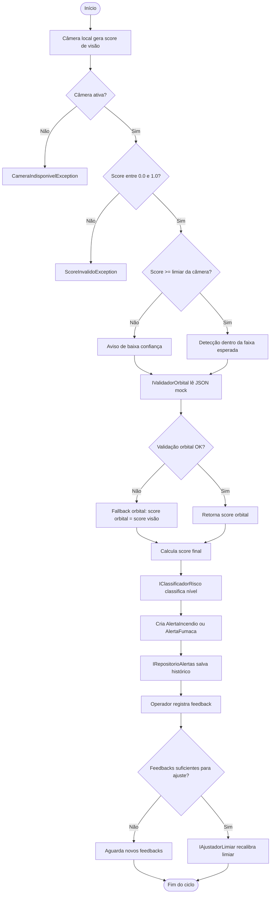

# FAROL Orbital — Módulo VIGÍLIA

**Global Solution 2026 · Space Connect · FIAP**  
**Disciplina:** C# / .NET

---

## Integrantes

| Nome | RM |
|---|---|
| Albert Katri | RM556544 |
| Bruno Biletsky | RM554739 |
| Paulo Akira | RM556840 |

---

## Sobre o projeto

O **FAROL Orbital** é uma solução de alerta ambiental criada para apoiar a identificação de situações de risco, como **incêndio** e **fumaça densa**, a partir de dados locais e validação orbital simulada.

Dentro da proposta da Global Solution **Space Connect**, o projeto trabalha a ideia de usar dados relacionados ao setor espacial como uma camada complementar de confiabilidade para problemas reais na Terra.

No MVP desenvolvido em C#/.NET, o sistema recebe uma detecção simulada de uma câmera local, consulta uma base mockada de dados orbitais, calcula um score final de risco, classifica o alerta e registra o evento para acompanhamento operacional.

O núcleo do projeto é o **Módulo VIGÍLIA**, responsável pelo processamento dos alertas ambientais.

---

## Objetivo

O objetivo do projeto é simular um fluxo básico de monitoramento ambiental com apoio de validação orbital, mantendo o código organizado e aplicando conceitos importantes de C# e Programação Orientada a Objetos.

O sistema permite:

- cadastrar e listar câmeras locais simuladas;
- simular detecções de risco ambiental;
- validar a detecção com dados orbitais mockados;
- calcular um score final do alerta;
- classificar o alerta por nível de risco;
- registrar histórico de alertas;
- registrar feedback do operador;
- ajustar o limiar de confiança da câmera com base nos feedbacks;
- manter evidências de execução do sistema.

---

## Relação com o tema Space Connect

O tema **Space Connect** propõe o uso de tecnologias ligadas à indústria espacial para gerar impacto positivo em problemas terrestres.

Neste projeto, essa relação aparece na etapa de **validação orbital simulada**. O arquivo:

```text
Data/dados_orbitais_mock.json
```

representa uma base fictícia de dados orbitais, simulando o que futuramente poderia ser substituído por informações vindas de satélites, sensores remotos ou serviços reais de monitoramento ambiental.

Na prática, o fluxo funciona assim:

1. A câmera local informa um score de visão.
2. O sistema consulta a validação orbital simulada.
3. Os scores são combinados para gerar um score final.
4. O alerta é classificado conforme o risco.
5. O operador pode confirmar ou negar o alerta.
6. O sistema usa os feedbacks para ajustar o limiar da câmera.

---

## Tecnologias utilizadas

| Tecnologia | Utilização |
|---|---|
| C# | Linguagem principal do projeto |
| .NET 8 | Plataforma utilizada para execução |
| Console App | Interface simples para interação com o sistema |
| JSON | Base mockada para simular dados orbitais |
| Programação Orientada a Objetos | Organização das entidades e regras do projeto |
| Interfaces | Separação entre contratos e implementações |
| DateTime | Registro de datas e horários dos eventos |

---

## Como executar

Pré-requisito: ter o **.NET 8 SDK** instalado.

No terminal, acesse a pasta do projeto e execute:

```bash
cd FarolOrbital
dotnet build
dotnet run
```

Após executar, o sistema exibirá um menu no console.

---

## Funcionalidades do menu

| Opção | Função |
|---|---|
| 1 | Listar câmeras cadastradas |
| 2 | Simular uma detecção ambiental |
| 3 | Listar alertas registrados |
| 4 | Registrar feedback do operador |
| 5 | Mostrar limiares das câmeras |
| 6 | Executar demo automática de ajuste de limiar |
| 0 | Sair do sistema |

---

## Funcionamento do cálculo de risco

O sistema trabalha com dois scores principais:

- `score_visao`: representa o risco identificado pela câmera local;
- `score_orbital`: representa a validação orbital simulada.

O score final é calculado a partir da combinação desses dois valores:

```text
score_final = (score_visao * PesoVisao) + (score_orbital * PesoOrbital)
```

Os pesos ficam centralizados na classe `ConfiguracoesSistema`, facilitando ajustes futuros sem espalhar valores fixos pelo código.

Depois do cálculo, o `MotorClassificacaoRisco` classifica o alerta em um nível de risco.

---

## Feedback do operador

Após a geração dos alertas, o operador pode registrar um feedback confirmando ou negando o evento.

Esse processo simula uma validação operacional feita por uma equipe responsável, como a Defesa Civil.

Os feedbacks ficam associados à câmera e são usados para ajustar o limiar de confiança. Assim, o sistema consegue demonstrar um ciclo simples de melhoria:

```text
detecção → alerta → feedback → ajuste de limiar
```

---

## Estrutura de pastas

```text
FarolOrbital/
├── Data/
│   └── dados_orbitais_mock.json
├── Docs/
│   └── Evidencias/
│       ├── 01_build_sucesso_+_menu_principal.jpg
│       ├── 02_cameras_cadastradas.jpg
│       ├── 03_alerta_alto.jpg
│       ├── 04_alerta_critico.jpg
│       ├── 05_alerta_medio.jpg
│       ├── 06_alerta_baixo.jpg
│       ├── 07_historico_alertas.jpg
│       ├── 08_feedback_confirmado.jpg
│       ├── 09_feedback_negado.jpg
│       ├── 10_limiares_cameras.jpg
│       ├── 11.1_demo_ajuste_limiar.jpg
│       ├── 11.2_demo_ajuste_limiar.jpg
│       ├── 11.3_demo_ajuste_limiar.jpg
│       ├── 11.4_demo_ajuste_limiar.jpg
│       ├── 11.5_demo_ajuste_limiar_opcao_sair.jpg
│       └── EVIDENCIAS.md
├── Domain/
├── Exceptions/
├── Interfaces/
├── Repositories/
├── Services/
├── Utils/
├── Program.cs
├── FarolOrbital.csproj
├── FarolOrbital.sln
├── .gitignore
└── README.md
```

---

## Organização do código

| Pasta | Conteúdo |
|---|---|
| `Domain/` | Entidades principais do sistema, como câmeras, alertas, operador e feedback |
| `Domain/Structs/` | Estruturas auxiliares, como coordenadas geográficas |
| `Interfaces/` | Contratos usados pelos serviços |
| `Services/` | Regras de negócio e processamento dos alertas |
| `Repositories/` | Repositório em memória para armazenar alertas |
| `Exceptions/` | Exceções específicas do sistema |
| `Utils/` | Configurações e funções auxiliares |
| `Data/` | Arquivo JSON com dados orbitais simulados |
| `Docs/Evidencias/` | Prints de execução e documentação das evidências |

---

## Principais conceitos aplicados

### Programação Orientada a Objetos

O projeto utiliza classes para representar as principais entidades do domínio, como câmeras, alertas, operador e feedbacks.

Também foram aplicados:

- encapsulamento com atributos privados;
- herança entre alertas;
- polimorfismo nos métodos sobrescritos;
- classes estáticas para configurações e formatação;
- classe privada interna para representar dados orbitais mockados.

### Abstração, herança e polimorfismo

A classe `AlertaAmbiental` foi criada como classe abstrata para representar a base comum dos alertas.

As classes `AlertaIncendio` e `AlertaFumaca` herdam dessa classe e implementam comportamentos específicos, como descrição e prioridade.

### Interfaces

O projeto usa interfaces para separar contratos das implementações:

- `IValidadorOrbital`;
- `IClassificadorRisco`;
- `IRepositorioAlertas`;
- `IAjustadorLimiar`.

Essa separação facilita manutenção, troca de implementações e evolução do projeto.

### Injeção de dependência

O `MotorAlerta` recebe suas dependências pelo construtor, usando as interfaces do projeto.

Com isso, o motor principal não fica preso diretamente às classes concretas, deixando o código mais organizado e desacoplado.

### Tratamento de exceções

O sistema possui exceções específicas para situações importantes:

- `ScoreInvalidoException`;
- `CameraIndisponivelException`;
- `ValidacaoOrbitalException`.

Caso a validação orbital falhe, o sistema usa um fallback para continuar o processamento sem encerrar abruptamente a aplicação.

### Struct e partial class

A estrutura `CoordenadaGeografica` foi criada como `struct`, pois representa um conjunto simples de valores.

A classe `CameraLocal` foi separada em arquivos `partial`, deixando o código mais organizado e isolando a parte relacionada aos feedbacks.

### Manipulação de datas

O projeto usa `DateTime` para registrar:

- data e hora de criação dos alertas;
- data e hora dos feedbacks;
- data de cadastro das câmeras;
- data de registro do operador.

---

## Diagrama de fluxo



---

## Evidências de execução

As evidências estão na pasta:

```text
Docs/Evidencias/
```

Essa pasta contém prints da execução do projeto, incluindo:

- menu principal;
- câmeras cadastradas;
- simulações de alerta;
- histórico de alertas;
- feedback confirmado;
- feedback negado;
- limiares das câmeras;
- demo automática de ajuste de limiar.

A descrição completa de cada print está no arquivo:

```text
Docs/Evidencias/EVIDENCIAS.md
```

---

## Considerações finais

O projeto foi desenvolvido com foco em um MVP funcional, simples de executar e coerente com a proposta da Global Solution.

A solução mantém uma arquitetura organizada, separando entidades, interfaces, serviços, repositórios, exceções, utilitários, dados mockados e evidências. O código aplica os principais conceitos de C# trabalhados na disciplina e deixa uma base preparada para futuras evoluções, como integração real com dados orbitais, dashboard ou aplicação mobile.
